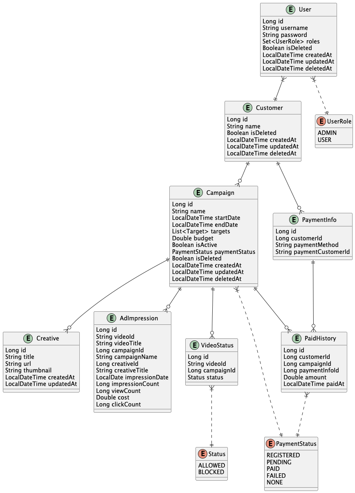

# ad-management

영상 삽입 광고의 캠페인과 노출 성과, 결제 정보를 관리하는 Kotlin/Spring Boot 백엔드 프로젝트입니다.

## 프로젝트 개요

주요 도메인은 다음과 같습니다.

- 사용자 등록
- 광고 캠페인 생성·조회·삭제
- 영상별 광고 노출 및 성과 조회
- 캠페인 성과 집계
- 결제 정보 등록 및 결제 이력 조회

## Tech Stack

- Kotlin 1.9
- Java 17
- Spring Boot 3.3
- Spring Web / Spring Validation
- Spring Data JPA
- QueryDSL
- Spring Security
- Spring Batch
- PostgreSQL
- Spring Actuator
- springdoc-openapi / Swagger UI
- Kotest / Spring Boot Test / Spring Security Test

## API

### Users

- `POST /api/users/register` — 사용자 등록

### Campaigns

- `POST /api/campaigns` — 캠페인 생성
- `GET /api/campaigns` — 캠페인 목록 조회
- `GET /api/campaigns/{id}` — 캠페인 상세 조회
- `DELETE /api/campaigns/{id}` — 캠페인 삭제
- `GET /api/campaigns/{id}/impressions` — 광고 노출 조회
- `GET /api/campaigns/{id}/impressions/{videoId}` — 특정 영상의 광고 노출 성과 조회
- `GET /api/campaigns/summary` — 캠페인 성과 집계 조회

### Payments

- `POST /api/payments/info` — 결제 정보 생성
- `POST /api/payments/submit` — 결제 제출
- `GET /api/payments/history/{customerId}` — 결제 내역 조회

## ERD



## 실행 방법

1. JDK 17 환경을 준비합니다.
2. 다음 환경 변수를 설정합니다.

```text
DB_URL
DB_NAME
DB_USERNAME
DB_PASSWORD
```

3. Spring Boot Application을 실행합니다.
4. 실행 후 Swagger UI에서 API를 확인할 수 있습니다.

```text
http://localhost:8080/swagger-ui.html
```

## 구현에서 사용한 주요 요소

- JPA 기반 영속성 계층
- QueryDSL 기반 조회
- Spring Security 기반 인증·인가 구성
- Batch 처리 지원
- Actuator를 통한 운영 상태 확인
- OpenAPI 문서화

> 이 저장소는 개인 프로젝트/과제 형태의 백엔드 구현 예제입니다. 실제 운영 환경에서는 인증 정책, 비밀정보 관리, 마이그레이션·배포 전략 등 운영 요구사항을 별도로 구성해야 합니다.
